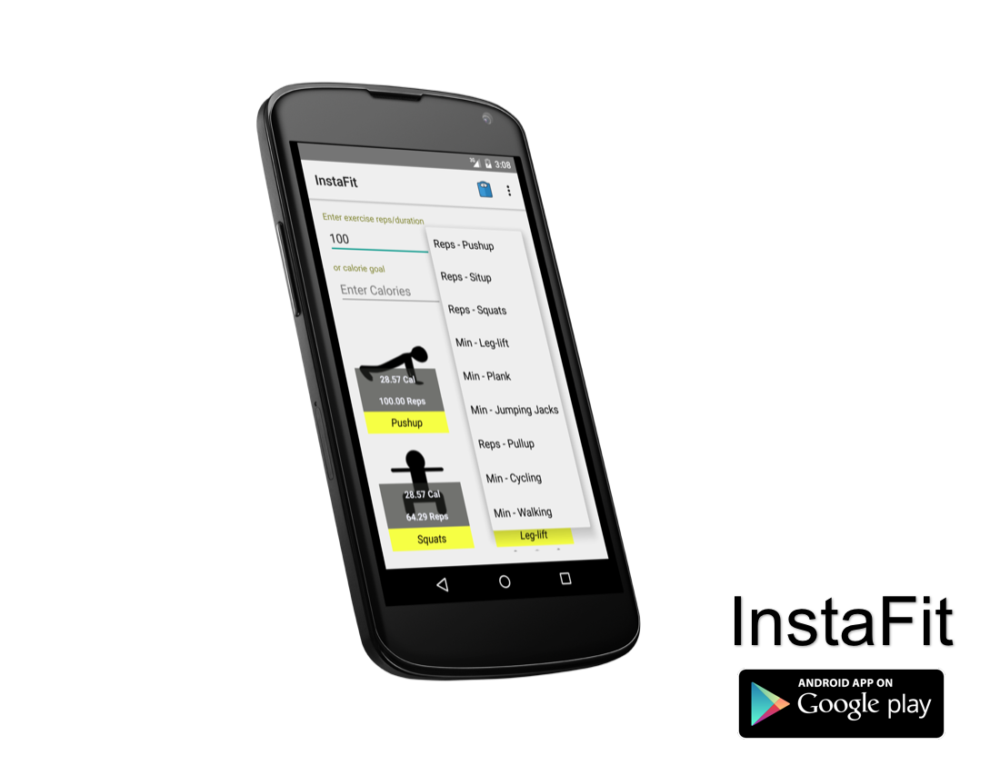
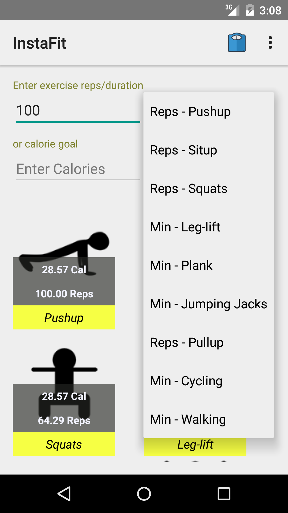
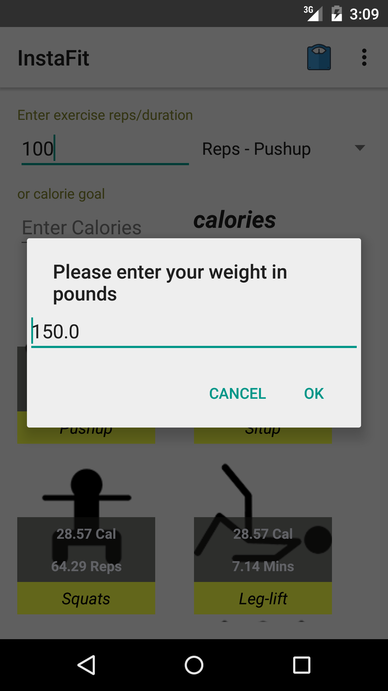
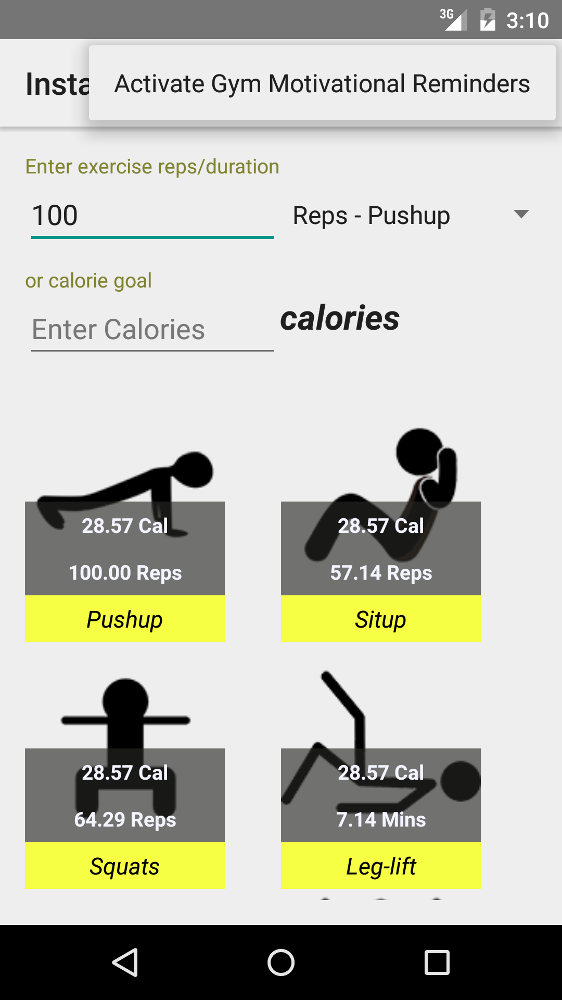

# PROG 01: Crunch Time | InstaFit

InstaFit helps you make educated descisions on what exericeses to perform. Just give InstaFit a calorie number, and the app will automatically calcualte the reps/duration that it would take you to burn your planned amount.

> It is not about working hard, it is all about working smart!

## Authors

Fadi Kfoury ([fadi.kfoury@berkeley.edu](mailto:fadi.kfoury@berkeley.edu))

## Demo Video

See [InstaFit YouTube Review] (https://www.youtube.com/watch?v=6zXQTfkgzvE)

## Screenshots

##App Features

### Home Screen

The home screen consists of four main elements:

•	Text field for entering reps / duration of a specific exercise
•	A drop-down field for choosing a specific exercise (positioned to the right of the reps/duration text-field).
•	A text field for entering the number of calories
•	A 2-column grid view that shows equivalent repetitions of all the app supported exercises.

When the user first launches the app the user will see a text field to enter reps or duration of specific exercise chosen from a drop down list to the right of the text field. The user will also have the option to enter the number of calories in another text field.
As the user enters values in of reps/duration or calories, the list view updates in real-time to reflect the equivalent exercise amount of other supported exercises.

### Custom Weight Feature

Using the “scale” icon in the app’s toolbar, the user can enter their weight. InstaFit uses this weight to infer more precise calories calculations. The custom weight feature is shown in Figure 3.

### Motivation Gym Reminders

Another feature that the app has, is “Gym Motivational Reminders”. Once activated, InstaFit will send the user motivational reminders 10 minutes before the user’s gym time. 
 
The user can activate the gym reminders from  the options menu. Upon activation, the app will prompt the user to enter his/her gym time. InstaFit utilizes the standard android UI for time input. 

The activation mechanism of the gym reminders is shown in Figure 4.

## Acknowledgments

* Icons are coursey of IconFinder.com

